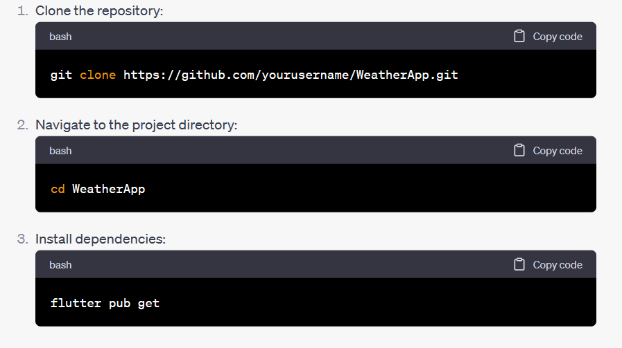
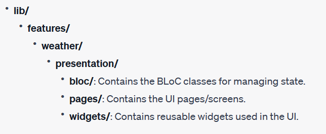

# Weather App
A simple Flutter weather app that allows users to search for weather information by city.

# Features
Search Weather: Users can enter a city and search for its current weather information.
Display Weather: Display the current weather conditions, temperature, and a 6-day forecast.

## Getting Started
To get started with this project, follow the steps below:

### Prerequisites
Flutter installed on your machine.
Installation

### Project Structure

### License

Feel free to customize the sections, add more details, or include any additional information relevant to your project. Don't forget to update the placeholders such as https://github.com/BiluAilu/A2SV-Project-phase-Mobile-Assessment.git, project structure, dependencies, and license information.

